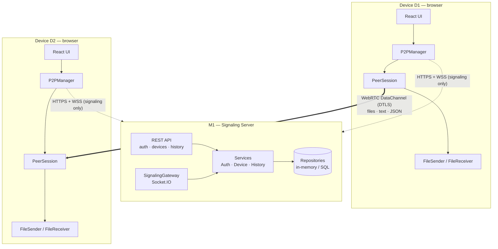
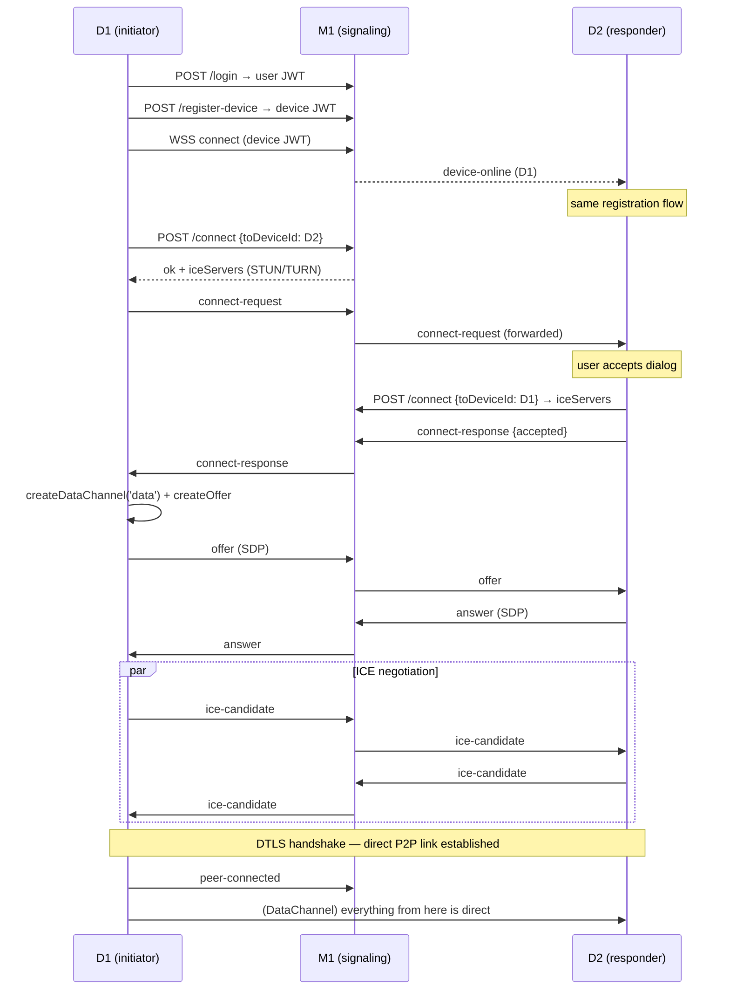

# Architecture

## Components



Every device runs the same code and is simultaneously **client and server**: `P2PManager`
both initiates connections (`requestConnection`) and accepts them (`acceptConnection`).
There is no permanent sender or receiver role; the DataChannel is bidirectional.

## Module responsibilities

### Server (M1)

| Module | Responsibility |
|---|---|
| `config/env.ts` | Env validation; builds the ICE server list (STUN + pluggable TURN) |
| `services/AuthService` | Signup/login, bcrypt, user JWTs + device-scoped JWTs |
| `services/DeviceService` | Device registry, presence, `assertCanConnect` permission gate |
| `services/HistoryService` | Transfer **metadata** records (never content) |
| `repositories/*` | Repository pattern; in-memory now, SQL later (see DATABASE.md) |
| `http/routes.ts` | REST endpoints (see API.md) |
| `socket/SignalingGateway` | JWT-authenticated presence + SDP/ICE forwarding with sender-identity enforcement and a 64 KB message cap |
| `container.ts` | Composition root — dependency injection without a framework |

### Client

| Module | Responsibility |
|---|---|
| `p2p/P2PManager` | Orchestrator: socket lifecycle, session registry, transfer registry, history reporting, event bus for the UI |
| `p2p/PeerSession` | One RTCPeerConnection + DataChannel per remote device; offer/answer, ICE candidate queueing, ICE-restart recovery, control-message routing |
| `p2p/FileSender` | Chunked streaming with `bufferedAmount` backpressure; pause/resume/cancel; resume-from-offset |
| `p2p/FileReceiver` | Ordered chunk assembly; streams to disk (File System Access API) or memory; acks progress every 32 chunks |
| `hooks/useP2P` | React bindings — one subscription per concern to scope re-renders |
| `context/AppContext` | Login/session persistence (sessionStorage) and manager lifecycle |

## Connection sequence



## File transfer sequence

```mermaid
sequenceDiagram
    participant S as Sender (FileSender)
    participant R as Receiver (FileReceiver)

    S->>R: file-offer {transferId, key, name, size, chunkSize, totalChunks}
    Note over R: user accepts → picks save location<br/>(File System Access API)
    R->>S: file-accept {resumeFrom: 0}
    loop until EOF (backpressure-controlled)
        S->>R: binary frame [key·chunkIndex·payload]
        Note over S: if bufferedAmount > 8 MB,<br/>wait for bufferedamountlow
        R-->>S: chunk-ack {receivedBytes} (every 32 chunks)
    end
    R->>R: close writable / trigger download
    R->>S: file-complete
    Note over S,R: both mark completed; sender POSTs<br/>metadata to /history
```

Pause/resume/cancel are control messages either side can send; `pause` stops the sender's
read loop, `resume` wakes it, `cancel` aborts and discards partial receiver state. On
connection loss the sender's retry re-offers the same `transferId`; the receiver answers
with `resumeFrom = receivedBytes` so only missing bytes are resent.

## Reconnection

- **Signaling drop:** Socket.IO auto-reconnects with exponential backoff; the server re-marks
  the device online and pushes a fresh device list.
- **Peer drop:** `connectionState → disconnected/failed` triggers up to two ICE restarts
  (initiator re-offers with `iceRestart: true`). If recovery fails, in-flight transfers are
  marked failed (retryable) and the session is torn down.

## Chunking & large-file design

- Chunk size defaults to **256 KiB** (`DEFAULT_CHUNK_SIZE`, configurable per transfer in the
  `file-offer` message — `P2PManager.chunkSize`).
- Binary frames carry an 8-byte header (`uint32 transferKey` + `uint32 chunkIndex`), allowing
  multiple concurrent transfers to multiplex one DataChannel.
- The sender reads `File.slice()` lazily — memory usage is bounded by the 8 MB send buffer,
  independent of file size.
- The receiver streams to disk on Chromium; 10 GB+ transfers never hold the file in memory.

## Future features — where they plug in

The DataChannel protocol is a tagged union (`ChannelMessage`); new capabilities are new
message types plus (for media) additional WebRTC tracks on the existing `RTCPeerConnection`:

| Feature | Extension point |
|---|---|
| Screen sharing / video / voice | `pc.addTrack(getDisplayMedia()/getUserMedia())` on `PeerSession`; renegotiate via existing offer/answer path |
| Remote terminal | New message types `term-open/term-data/term-close` routed like text messages |
| Clipboard sharing | `json` messages with a `clipboard` payload envelope |
| Folder sync | Manifest exchange (`json`) + existing file transfer engine per changed file |
| LAN discovery | mDNS agent or server-side same-subnet hinting from observed IPs |
